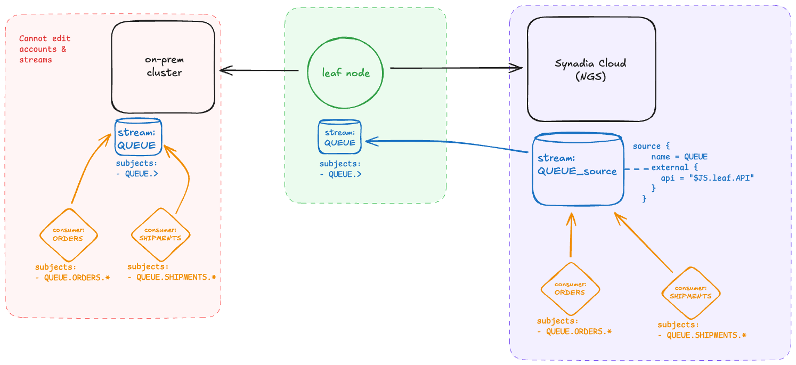
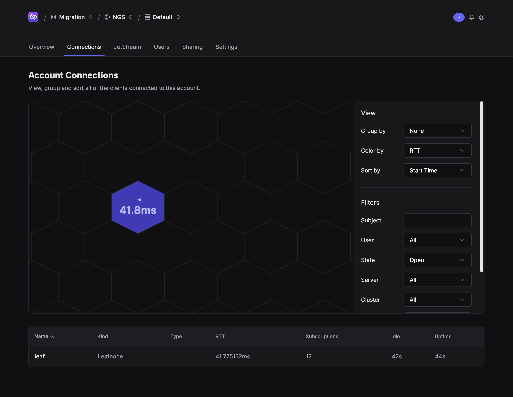
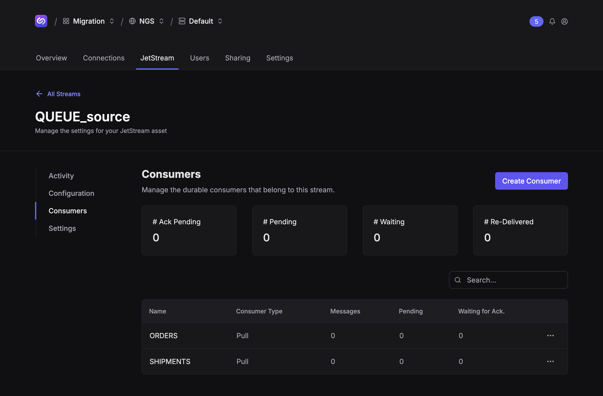
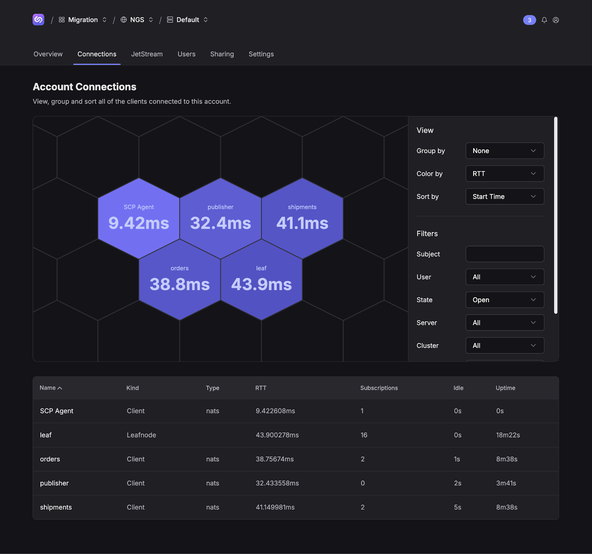

# Cross-System JetStream Migration

> [!TIP]
> See https://synadia-labs.github.io/cross-system-jetstream-migration/ for an easier way to consume this README

<!-- index: start -->
Steps for migrating JetStream assets to [Synadia Cloud](https://www.synadia.com/cloud) with minimal downtime and impact to the existing NATS Cluster.

The steps below include setting up a local NATS server with `nsc` for a fully reproducible walkthrough, creating streams and consumers with the NATS [Terraform JetStream provider](https://github.com/nats-io/terraform-provider-jetstream), and running a few Go micro services to mimic real services that publish to and consume from NATS streams.

Required tooling:

- [NATS CLI](https://github.com/nats-io/natscli/)
- [nsc](https://github.com/nats-io/nsc) — tool for creating NATS operators, accounts, and users
- [Go](https://go.dev/dl/) — Required for NATS micro services
- [Terraform](https://developer.hashicorp.com/terraform/cli/commands) — Required for provisioning JetStream assets

---

The following steps minimize changes required to the existing self-managed system to mimic real world use cases. These steps do not require adding a JetStream domain. Instead, the leaf node is used as an intermediary between the self-managed and Synadia Cloud systems. Using a leaf node enables configuring a JetStream domain, which is needed to connect a NATS system with JetStream into Synadia Cloud and source/mirror from it.

**Not** updating the self-managed system’s JetStream domain is desirable because updating the domain affects any client that have an open a JetStream context to the old domain. It might also break any sourcing/mirroring setups.



<!-- index: end -->

<!-- local: start -->
### Setup `.env`

This example uses [direnv](https://direnv.net/) to load local `.env` files as shell variables.

```shell
❯ cp .env.template .env
❯ direnv allow
direnv: export +NATS_CREDS_PATH +NATS_STREAM_NAME +NATS_URL
```

### Initialize operator, account, and users with `nsc`

Initialize a local `nsc` config, including an operator, account, and users.

```shell
❯ make init-nsc
❯ tree -L2 .nsc 
.nsc
├── creds
│   └── local
├── keys
│   ├── A
│   ├── O
│   └── U
├── local
│   ├── accounts
│   └── local.jwt
├── nsc.conf
└── nsc.json
```

### Start local NATS server

Start a local NATS server using the `nsc` configuration (`./.nsc/nsc.conf`). 

> [!NOTE]
> NKey values will be different in your output.

```shell
❯ make local
nats-server -c nats.conf
[18828] 2025/08/14 10:53:52.434907 [INF] Starting nats-server
[18828] 2025/08/14 10:53:52.434991 [INF]   Version:  2.11.7
[18828] 2025/08/14 10:53:52.434993 [INF]   Git:      [df44964]
[18828] 2025/08/14 10:53:52.435006 [INF]   Cluster:  leaf
[18828] 2025/08/14 10:53:52.435007 [INF]   Name:     leaf
[18828] 2025/08/14 10:53:52.435008 [INF]   Node:     ZLMV550B
[18828] 2025/08/14 10:53:52.435009 [INF]   ID:       NDCVTRDUCIKXHIDXV5E2B2BTSZ5L7WOZFKSH35UMX5DSUF57RNUPYHDL
[18828] 2025/08/14 10:53:52.435026 [INF] Trusted Operators
[18828] 2025/08/14 10:53:52.435028 [INF]   System  : ""
[18828] 2025/08/14 10:53:52.435029 [INF]   Operator: "memory"
[18828] 2025/08/14 10:53:52.435031 [INF]   Issued  : 2025-08-14 10:51:51 -0600 MDT
[18828] 2025/08/14 10:53:52.435038 [INF]   Expires : Never
[18828] 2025/08/14 10:53:52.436161 [INF] Starting JetStream
[18828] 2025/08/14 10:53:52.436167 [WRN] Temporary storage directory used, data could be lost on system reboot
[18828] 2025/08/14 10:53:52.436715 [INF]     _ ___ _____ ___ _____ ___ ___   _   __  __
[18828] 2025/08/14 10:53:52.436717 [INF]  _ | | __|_   _/ __|_   _| _ \ __| /_\ |  \/  |
[18828] 2025/08/14 10:53:52.436718 [INF] | || | _|  | | \__ \ | | |   / _| / _ \| |\/| |
[18828] 2025/08/14 10:53:52.436719 [INF]  \__/|___| |_| |___/ |_| |_|_\___/_/ \_\_|  |_|
[18828] 2025/08/14 10:53:52.436720 [INF]
[18828] 2025/08/14 10:53:52.436721 [INF]          https://docs.nats.io/jetstream
[18828] 2025/08/14 10:53:52.436722 [INF]
[18828] 2025/08/14 10:53:52.436723 [INF] ---------------- JETSTREAM ----------------
[18828] 2025/08/14 10:53:52.436758 [INF]   Max Memory:      1.00 GB
[18828] 2025/08/14 10:53:52.436760 [INF]   Max Storage:     1.00 GB
[18828] 2025/08/14 10:53:52.436761 [INF]   Store Directory: "/var/folders/q3/sxmzn9xs6r90xcfzr3g5ch2m0000gn/T/jetstream"
[18828] 2025/08/14 10:53:52.436762 [INF]   API Level:       1
[18828] 2025/08/14 10:53:52.436764 [INF] -------------------------------------------
[18828] 2025/08/14 10:53:52.437383 [INF] Listening for client connections on 0.0.0.0:4222
[18828] 2025/08/14 10:53:52.437509 [INF] Server is ready
```

### Create local stream and consumers using Terraform.

Provision a single stream and two consumers. These will be used by the Go micro services. The stream uses an "interest" retention policy, acting as a durable queue.

> [!IMPORTANT]  
> You cannot source/mirror from streamsw the interest or work queue retention policies.

```shell
❯ cd ./tf/local
❯ terraform apply -auto-approve  # or `terraform plan -out plan.out` and `terraform apply plan.out`
Terraform used the selected providers to generate the following execution plan. Resource actions are indicated with the following symbols:
  + create

Terraform will perform the following actions:

  # jetstream_consumer.ORDERS will be created
  + resource "jetstream_consumer" "ORDERS" {
      + ...
    }

  # jetstream_consumer.SHIPMENTS will be created
  + resource "jetstream_consumer" "SHIPMENTS" {
      + ...
    }

  # jetstream_stream.QUEUE will be created
  + resource "jetstream_stream" "QUEUE" {
      + ...
    }

Plan: 3 to add, 0 to change, 0 to destroy.
jetstream_stream.QUEUE: Creating...
jetstream_stream.QUEUE: Creation complete after 1s [id=JETSTREAM_STREAM_QUEUE]
jetstream_consumer.SHIPMENTS: Creating...
jetstream_consumer.ORDERS: Creating...
jetstream_consumer.ORDERS: Creation complete after 0s [id=JETSTREAM_STREAM_QUEUE_CONSUMER_ORDERS]
jetstream_consumer.SHIPMENTS: Creation complete after 0s [id=JETSTREAM_STREAM_QUEUE_CONSUMER_SHIPMENTS]

Apply complete! Resources: 3 added, 0 changed, 0 destroyed.
```

View the created stream and consumers.

```shell
❯ nats --creds ../../.nsc/creds/memory/A/admin.creds stream report
Obtaining Stream stats

╭─────────────────────────────────────────────────────────────────────────────────────────╮
│                                      Stream Report                                      │
├────────┬─────────┬───────────┬───────────┬──────────┬───────┬──────┬─────────┬──────────┤
│ Stream │ Storage │ Placement │ Consumers │ Messages │ Bytes │ Lost │ Deleted │ Replicas │
├────────┼─────────┼───────────┼───────────┼──────────┼───────┼──────┼─────────┼──────────┤
│ QUEUE  │ File    │           │ 2         │ 0        │ 0 B   │ 0    │ 0       │          │
╰────────┴─────────┴───────────┴───────────┴──────────┴───────┴──────┴─────────┴──────────╯

❯ nats --creds ../../.nsc/creds/memory/A/admin.creds consumer report QUEUE
╭──────────────────────────────────────────────────────────────────────────────────────────────────────────╮
│                                Consumer report for QUEUE with 2 consumers                                │
├───────────┬──────┬────────────┬──────────┬─────────────┬─────────────┬─────────────┬───────────┬─────────┤
│ Consumer  │ Mode │ Ack Policy │ Ack Wait │ Ack Pending │ Redelivered │ Unprocessed │ Ack Floor │ Cluster │
├───────────┼──────┼────────────┼──────────┼─────────────┼─────────────┼─────────────┼───────────┼─────────┤
│ ORDERS    │ Pull │ Explicit   │ 30.00s   │ 0           │ 0           │ 0           │ 0         │         │
│ SHIPMENTS │ Pull │ Explicit   │ 30.00s   │ 0           │ 0           │ 0           │ 0         │         │
╰───────────┴──────┴────────────┴──────────┴─────────────┴─────────────┴─────────────┴───────────┴─────────╯
```

### Start publisher

Start the `publisher` Go micro service, which publishes new orders to the stream.

```shell
❯ cd demo
❯ make publisher
Publishing on nats://localhost:4222
Publishing order 1
```

In another tab, verify the stream has messages and the `ORDERS` consumer has unprocessed messages.
```shell
# from the root of the repo
❯ nats --creds .nsc/creds/memory/A/admin.creds stream report
Obtaining Stream stats

╭─────────────────────────────────────────────────────────────────────────────────────────╮
│                                      Stream Report                                      │
├────────┬─────────┬───────────┬───────────┬──────────┬───────┬──────┬─────────┬──────────┤
│ Stream │ Storage │ Placement │ Consumers │ Messages │ Bytes │ Lost │ Deleted │ Replicas │
├────────┼─────────┼───────────┼───────────┼──────────┼───────┼──────┼─────────┼──────────┤
│ QUEUE  │ File    │           │ 2         │ 3        │ 132 B │ 0    │ 0       │          │
╰────────┴─────────┴───────────┴───────────┴──────────┴───────┴──────┴─────────┴──────────╯

❯ nats --creds .nsc/creds/memory/A/admin.creds consumer report QUEUE
╭────────────────────────────────────────────────────────────────────────────────────────────────────────╮
│                               Consumer report for QUEUE with 2 consumers                               │
├───────────┬──────┬────────────┬──────────┬─────────────┬─────────────┬─────────────┬───────────┬───────┤
│ Consumer  │ Mode │ Ack Policy │ Ack Wait │ Ack Pending │ Redelivered │ Unprocessed │ Ack Floor │ Clust │
├───────────┼──────┼────────────┼──────────┼─────────────┼─────────────┼─────────────┼───────────┼───────┤
│ ORDERS    │ Pull │ Explicit   │ 30.00s   │ 0           │ 0           │ 3 / 100%    │ 0         │       │
│ SHIPMENTS │ Pull │ Explicit   │ 30.00s   │ 0           │ 0           │ 0           │ 0         │       │
╰───────────┴──────┴────────────┴──────────┴─────────────┴─────────────┴─────────────┴───────────┴───────╯
```

### Start services

Start the `orders` and `shipments` services, which will consume messages from their respective consumers.

The `orders` service will trigger shipments when it finished processing the order. 

```shell
❯ cd demo
❯ make orders
Consuming orders on nats://localhost:4222
Received order: 1
Received order: 2

# in another tab
❯ cd demo
❯ make shipments
Consuming shipments on nats://localhost:4222
Received shipment: 1
Received shipment: 2
```

Confirm that messages in the consumers are being processed.

```shell
❯ nats --creds .nsc/creds/memory/A/admin.creds consumer report QUEUE
╭──────────────────────────────────────────────────────────────────────────────────────────────────────────╮
│                                Consumer report for QUEUE with 2 consumers                                │
├───────────┬──────┬────────────┬──────────┬─────────────┬─────────────┬─────────────┬───────────┬─────────┤
│ Consumer  │ Mode │ Ack Policy │ Ack Wait │ Ack Pending │ Redelivered │ Unprocessed │ Ack Floor │ Cluster │
├───────────┼──────┼────────────┼──────────┼─────────────┼─────────────┼─────────────┼───────────┼─────────┤
│ ORDERS    │ Pull │ Explicit   │ 30.00s   │ 95          │ 0           │ 26 / 18%    │ 35        │         │
│ SHIPMENTS │ Pull │ Explicit   │ 30.00s   │ 10          │ 0           │ 12 / 8%     │ 147       │         │
╰───────────┴──────┴────────────┴──────────┴─────────────┴─────────────┴─────────────┴───────────┴─────────╯
```
<!-- local: end -->

<!-- leaf: start -->
### Create a separate NATS server that uses a JetStream domain, to be used as a leaf node

Initialize a local `nsc` config for the leaf node.

```shell
❯ make init-leaf-nsc
❯ tree -L2 .nsc 
.leaf
├── creds
│   └── leaf
├── keys
│   ├── A
│   ├── O
│   └── U
├── leaf
│   ├── accounts
│   └── leaf.jwt
├── nsc.conf
└── nsc.json
```

### Start leaf node NATS server

Start the leaf node NATS server using the `nsc` configuration (`./.leaf/nsc.conf`). Note the `leafnodes.remotes` value that connects this server to the "local" server:

```
leafnodes {
  remotes = [
    {
      url: "nats://localhost:7422"
      credentials: ".nsc/creds/local/A/admin.creds"
      account: "A..."
    },
    ...
  ]
}
```

> [!NOTE]
> NKey values will be different in your output.


```shell
❯ make leaf
❯ make leaf                              
nats-server -c leaf.conf
[27274] 2025/08/25 08:35:30.283060 [INF] Starting nats-server
[27274] 2025/08/25 08:35:30.283160 [INF]   Version:  2.11.7
[27274] 2025/08/25 08:35:30.283162 [INF]   Git:      [df44964]
[27274] 2025/08/25 08:35:30.283164 [INF]   Name:     leaf
[27274] 2025/08/25 08:35:30.283165 [INF]   Node:     ZLMV550B
[27274] 2025/08/25 08:35:30.283166 [INF]   ID:       NA7CAQ7BK3UBPNX6BALDGCCRCIFALLDPBQC43AJNX76IHMOA3TMQXLYG
[27274] 2025/08/25 08:35:30.283175 [INF] Using configuration file: leaf.conf (sha256:fcd90964b146f77d21f613fcd03f72b0843495714df49638e57ee093d53f0478)
[27274] 2025/08/25 08:35:30.283179 [INF] Trusted Operators
[27274] 2025/08/25 08:35:30.283180 [INF]   System  : ""
[27274] 2025/08/25 08:35:30.283181 [INF]   Operator: "leaf"
[27274] 2025/08/25 08:35:30.283184 [INF]   Issued  : 2025-08-25 08:25:36 -0700 PDT
[27274] 2025/08/25 08:35:30.283194 [INF]   Expires : Never
[27274] 2025/08/25 08:35:30.283586 [INF] Starting JetStream
[27274] 2025/08/25 08:35:30.283598 [WRN] Temporary storage directory used, data could be lost on system reboot
[27274] 2025/08/25 08:35:30.283859 [INF]     _ ___ _____ ___ _____ ___ ___   _   __  __
[27274] 2025/08/25 08:35:30.283863 [INF]  _ | | __|_   _/ __|_   _| _ \ __| /_\ |  \/  |
[27274] 2025/08/25 08:35:30.283865 [INF] | || | _|  | | \__ \ | | |   / _| / _ \| |\/| |
[27274] 2025/08/25 08:35:30.283866 [INF]  \__/|___| |_| |___/ |_| |_|_\___/_/ \_\_|  |_|
[27274] 2025/08/25 08:35:30.283867 [INF] 
[27274] 2025/08/25 08:35:30.283868 [INF]          https://docs.nats.io/jetstream
[27274] 2025/08/25 08:35:30.283869 [INF] 
[27274] 2025/08/25 08:35:30.283870 [INF] ---------------- JETSTREAM ----------------
[27274] 2025/08/25 08:35:30.283877 [INF]   Max Memory:      1.00 GB
[27274] 2025/08/25 08:35:30.283880 [INF]   Max Storage:     1.00 GB
[27274] 2025/08/25 08:35:30.283881 [INF]   Store Directory: "/var/folders/q3/sxmzn9xs6r90xcfzr3g5ch2m0000gn/T/jetstream"
[27274] 2025/08/25 08:35:30.283882 [INF]   Domain:          leaf
[27274] 2025/08/25 08:35:30.283883 [INF]   API Level:       1
[27274] 2025/08/25 08:35:30.283885 [INF] -------------------------------------------
[27274] 2025/08/25 08:35:30.284202 [WRN] Account fetch failed: account missing
[27274] 2025/08/25 08:35:30.284207 [WRN] Account fetch failed: account missing
[27274] 2025/08/25 08:35:30.284743 [INF] Listening for client connections on 0.0.0.0:4223
[27274] 2025/08/25 08:35:30.284873 [INF] Server is ready
[27274] 2025/08/25 08:35:30.286881 [INF] 127.0.0.1:7422 - lid:6 - Leafnode connection created for account: ABIV654V3C2AS4Y6NMZDPHVVOERHABHMBXNS2PFVSQQSGW6QIOQWR6FR/A 
[27274] 2025/08/25 08:35:30.289002 [INF] 127.0.0.1:7422 - lid:6 - JetStream using domains: local "leaf", remote ""
^C[27274] 2025/08/25 08:35:35.798395 [INF] Trapped "interrupt" signal
[27274] 2025/08/25 08:35:35.798677 [INF] Initiating Shutdown...
[27274] 2025/08/25 08:35:35.798705 [INF] Initiating JetStream Shutdown...
[27274] 2025/08/25 08:35:35.798718 [INF] JetStream Shutdown
[27274] 2025/08/25 08:35:35.798851 [INF] 127.0.0.1:7422 - lid:6 - Leafnode connection closed: Server Shutdown - Account: ABIV654V3C2AS4Y6NMZDPHVVOERHABHMBXNS2PFVSQQSGW6QIOQWR6FR/A
```

### Create clones of streams from the self-managed cluster into the leaf node

The streams in the leaf node will use “limits” retention policies, which is required for sourcing/mirroring. Interest and work queue policies are not supported when sourcing/mirroring.

```shell
❯ cd ./tf/leaf
❯ terraform apply -auto-approve  # or `terraform plan -out plan.out` and `terraform apply plan.out`
jetstream_stream.QUEUE: Refreshing state... [id=JETSTREAM_STREAM_QUEUE]

Terraform used the selected providers to generate the following execution plan. Resource actions are indicated with the following symbols:
  + create

Terraform will perform the following actions:

  # jetstream_stream.QUEUE will be created
  + resource "jetstream_stream" "QUEUE" {
      + ack                     = true
      + allow_direct            = true
      + allow_msg_ttl           = false
      + allow_rollup_hdrs       = false
      + compression             = "none"
      + deny_delete             = false
      + deny_purge              = false
      + discard                 = "old"
      + discard_new_per_subject = false
      + duplicate_window        = 120
      + id                      = (known after apply)
      + max_age                 = 86400
      + max_bytes               = 10485760
      + max_consumers           = -1
      + max_msg_size            = -1
      + max_msgs                = 1024
      + max_msgs_per_subject    = -1
      + name                    = "QUEUE"
      + replicas                = 1
      + retention               = "limits"
      + storage                 = "file"
      + subjects                = [
          + "QUEUE.>",
        ]
    }

Plan: 1 to add, 0 to change, 0 to destroy.
jetstream_stream.QUEUE: Creating...
jetstream_stream.QUEUE: Creation complete after 0s [id=JETSTREAM_STREAM_QUEUE]

Apply complete! Resources: 1 added, 0 changed, 0 destroyed.
```

View the created stream.

```shell
❯ nats --server nats://localhost:4223 --creds ../../.leaf/creds/leaf/A/leaf.creds stream report 
Obtaining Stream stats

╭─────────────────────────────────────────────────────────────────────────────────────────────────────╮
│                                            Stream Report                                            │
├────────┬─────────┬───────────┬───────────┬──────────┬───────┬──────┬─────────┬───────────┬──────────┤
│ Stream │ Storage │ Placement │ Consumers │ Messages │ Bytes │ Lost │ Deleted │ API Level │ Replicas │
├────────┼─────────┼───────────┼───────────┼──────────┼───────┼──────┼─────────┼───────────┼──────────┤
│ QUEUE  │ File    │           │ 0         │ 0        │ 0 B   │ 0    │ 0       │ 0         │          │
╰────────┴─────────┴───────────┴───────────┴──────────┴───────┴──────┴─────────┴───────────┴──────────╯
```
<!-- leaf: end -->

<!-- cloud: start -->
### Connect the leaf node to the Synadia Cloud system

First things first, we need to download NATS user credentials to connect the leaf node to Synadia Cloud.

Navigate to the NATS User (`Team > System > Account > NATS User`) you want to use to connect the local system to Synadia Cloud. Click `Get Connected` and download the credentials file. Save it to `./tf/cloud/cloud.creds`.

Uncomment the second `leafnodes.remotes` block in `leaf.conf` and restart the leaf node server.

```diff
     {
       url: "nats://localhost:7422"
       credentials: ".nsc/creds/local/A/admin.creds"
     },
-    # {
-    #   url: "tls://connect.ngs.global"
-    #   credentials: "./tf/cloud/cloud.creds"
-    #   account: A...
-    # }
+    {
+      url: "tls://connect.ngs.global"
+      credentials: "./tf/cloud/cloud.creds"
+      account: "ABIV654V3C2AS4Y6NMZDPHVVOERHABHMBXNS2PFVSQQSGW6QIOQWR6FR"
+    }
```

Restart the NATS server (the `reload` signal is not supported when editing `leafnodes.remotes`, e.g. `nats-server –signal reload`).

Verify the leaf node shows up in the Synadia Cloud connections graph, under `Team > System > Account > Connections`.



### Create streams in Synadia Cloud

Create clones of the stream and consumers in Synadia Cloud using Terraform. This stream will use the original stream’s "interest" retention policy. Only the streams being sourced/mirroed **from** require the "limits" retention policy.

Note the use of `external.api` to map to the leaf node’s JetStream domain. This is required when sourcing across different NATS systems.

```shell
❯ cd ./tf/cloud
❯ terraform apply -auto-approve  # or `terraform plan -out plan.out` and `terraform apply plan.out`

Terraform used the selected providers to generate the following execution plan. Resource actions are indicated with the following symbols:
  + create

Terraform will perform the following actions:

  # jetstream_consumer.ORDERS_cloud will be created
  + resource "jetstream_consumer" "ORDERS_cloud" {
      ...
    }

  # jetstream_consumer.SHIPMENTS_cloud will be created
  + resource "jetstream_consumer" "SHIPMENTS_cloud" {
      ...
    }

  # jetstream_stream.QUEUE_source will be created
  + resource "jetstream_stream" "QUEUE_source" {
      ...
      + retention               = "interest"

      + source {
          + name = "QUEUE"

          + external {
              + api = "$JS.leaf.API"
            }
        }
    }

Plan: 3 to add, 0 to change, 0 to destroy.
jetstream_stream.QUEUE_source: Creating...
jetstream_stream.QUEUE_source: Creation complete after 1s [id=JETSTREAM_STREAM_QUEUE_source]
jetstream_consumer.SHIPMENTS_cloud: Creating...
jetstream_consumer.ORDERS_cloud: Creating...
jetstream_consumer.ORDERS_cloud: Creation complete after 1s [id=JETSTREAM_STREAM_QUEUE_source_CONSUMER_ORDERS]
jetstream_consumer.SHIPMENTS_cloud: Creation complete after 1s [id=JETSTREAM_STREAM_QUEUE_source_CONSUMER_SHIPMENTS]

Apply complete! Resources: 3 added, 0 changed, 0 destroyed.
```

View the created stream and consumers.

```shell
❯ nats --server tls://connect.ngs.global --creds tf/cloud/cloud.creds stream report
╭─────────────────────────────────────────────────────────────────────────────────────────────────────────────╮
│                                                Stream Report                                                │
├──────────────┬─────────┬───────────┬───────────┬──────────┬───────┬──────┬─────────┬────────────────────────┤
│ Stream       │ Storage │ Placement │ Consumers │ Messages │ Bytes │ Lost │ Deleted │ Replicas               │
├──────────────┼─────────┼───────────┼───────────┼──────────┼───────┼──────┼─────────┼────────────────────────┤
│ QUEUE_source │ File    │           │ 2         │ 0        │ 0 B   │ 0    │ 0       │ aws-uswest2-natscj1-1* │
╰──────────────┴─────────┴───────────┴───────────┴──────────┴───────┴──────┴─────────┴────────────────────────╯

╭────────────────────────────────────────────────────────────────────────────────────────────────────╮
│                                         Replication Report                                         │
├──────────────┬────────┬────────────┬───────────────┬────────────────────────┬────────┬─────┬───────┤
│ Stream       │ Kind   │ API Prefix │ Source Stream │ Filters and Transforms │ Active │ Lag │ Error │
├──────────────┼────────┼────────────┼───────────────┼────────────────────────┼────────┼─────┼───────┤
│ QUEUE_source │ Source │            │ QUEUE         │                        │ 0s     │ 0   │       │
╰──────────────┴────────┴────────────┴───────────────┴────────────────────────┴────────┴─────┴───────╯

❯ nats --server tls://connect.ngs.global --creds tf/cloud/cloud.creds consumer report QUEUE_source
╭─────────────────────────────────────────────────────────────────────────────────────────────────────────────────────────╮
│                                    Consumer report for QUEUE_source with 2 consumers                                    │
├───────────┬──────┬────────────┬──────────┬─────────────┬─────────────┬─────────────┬───────────┬────────────────────────┤
│ Consumer  │ Mode │ Ack Policy │ Ack Wait │ Ack Pending │ Redelivered │ Unprocessed │ Ack Floor │ Cluster                │
├───────────┼──────┼────────────┼──────────┼─────────────┼─────────────┼─────────────┼───────────┼────────────────────────┤
│ ORDERS    │ Pull │ Explicit   │ 30.00s   │ 0           │ 0           │ 0           │ 0         │ aws-uswest2-natscj1-1* │
│ SHIPMENTS │ Pull │ Explicit   │ 30.00s   │ 0           │ 0           │ 0           │ 0         │ aws-uswest2-natscj1-1* │
╰───────────┴──────┴────────────┴──────────┴─────────────┴─────────────┴─────────────┴───────────┴────────────────────────╯
```

You can also see the stream in Synadia Cloud.




### Migrate services to use Synadia Cloud

In general, updating services will depend on how the services interact with NATS. For this example walkthrough, we will update the `.env` values and restart the services.

```diff
- NATS_URL=nats://localhost:4222
- NATS_CREDS_PATH=.nsc/creds/local/A/admin.creds
+ NATS_URL=tls://connect.ngs.global
+ NATS_CREDS_PATH=tf/cloud/cloud.creds
```

Restart the `orders` and `shipments` services. Verify they are connected in the Synadia Cloud connections tab.


Verify messages are being processed using the NATS CLI.
```shell
╭─────────────────────────────────────────────────────────────────────────────────────────────────────────────╮
│                                                Stream Report                                                │
├──────────────┬─────────┬───────────┬───────────┬──────────┬────────┬──────┬─────────┬───────────────────────┤
│ Stream       │ Storage │ Placement │ Consumers │ Messages │ Bytes  │ Lost │ Deleted │ Replicas              │
├──────────────┼─────────┼───────────┼───────────┼──────────┼────────┼──────┼─────────┼───────────────────────┤
│ QUEUE_source │ File    │           │ 2         │ 248      │ 27 KiB │ 0    │ 25      │ az-uswest2-natscj1-2* │
╰──────────────┴─────────┴───────────┴───────────┴──────────┴────────┴──────┴─────────┴───────────────────────╯

╭──────────────────────────────────────────────────────────────────────────────────────────────────────╮
│                                          Replication Report                                          │
├──────────────┬────────┬──────────────┬───────────────┬────────────────────────┬────────┬─────┬───────┤
│ Stream       │ Kind   │ API Prefix   │ Source Stream │ Filters and Transforms │ Active │ Lag │ Error │
├──────────────┼────────┼──────────────┼───────────────┼────────────────────────┼────────┼─────┼───────┤
│ QUEUE_source │ Source │ $JS.leaf.API │ QUEUE         │                        │ 57ms   │ 0   │       │
╰──────────────┴────────┴──────────────┴───────────────┴────────────────────────┴────────┴─────┴───────╯

❯ nats --server tls://connect.ngs.global --creds tf/cloud/cloud.creds consumer report QUEUE_source
╭────────────────────────────────────────────────────────────────────────────────────────────────────────────────────────╮
│                                    Consumer report for QUEUE_source with 2 consumers                                   │
├───────────┬──────┬────────────┬──────────┬─────────────┬─────────────┬─────────────┬───────────┬───────────────────────┤
│ Consumer  │ Mode │ Ack Policy │ Ack Wait │ Ack Pending │ Redelivered │ Unprocessed │ Ack Floor │ Cluster               │
├───────────┼──────┼────────────┼──────────┼─────────────┼─────────────┼─────────────┼───────────┼───────────────────────┤
│ ORDERS    │ Pull │ Explicit   │ 30.00s   │ 113         │ 96          │ 27 / 10%    │ 226       │ az-uswest2-natscj1-2* │
│ SHIPMENTS │ Pull │ Explicit   │ 30.00s   │ 83          │ 70          │ 29 / 11%    │ 167       │ az-uswest2-natscj1-2* │
╰───────────┴──────┴────────────┴──────────┴─────────────┴─────────────┴─────────────┴───────────┴───────────────────────╯
```

### Migrate publisher to use Synadia Cloud

Update the Synadia Cloud stream to listen on the same subjects as its self-managed counterparts.

```toml
# tf/cloud/cloud.td
resource "jetstream_stream" "QUEUE" {
  name      = "QUEUE"
  subjects     = ["QUEUE.>"]  # <-- add this line
  ...
}
```

```shell
❯ terraform apply -auto-approve
jetstream_stream.QUEUE: Refreshing state... [id=JETSTREAM_STREAM_QUEUE]
jetstream_consumer.SHIPMENTS_cloud: Refreshing state... [id=JETSTREAM_STREAM_QUEUE_CONSUMER_SHIPMENTS]
jetstream_consumer.ORDERS_cloud: Refreshing state... [id=JETSTREAM_STREAM_QUEUE_CONSUMER_ORDERS]

Terraform used the selected providers to generate the following execution plan. Resource actions are indicated with the following symbols:
  ~ update in-place

Terraform will perform the following actions:

  # jetstream_stream.QUEUE will be updated in-place
  ~ resource "jetstream_stream" "QUEUE" {
        id                        = "JETSTREAM_STREAM_QUEUE"
        name                      = "QUEUE"
      ~ subjects                  = [
          + "QUEUE.>",
        ]
        # (24 unchanged attributes hidden)

        # (1 unchanged block hidden)
    }

Plan: 0 to add, 1 to change, 0 to destroy.
jetstream_stream.QUEUE: Modifying... [id=JETSTREAM_STREAM_QUEUE]
jetstream_stream.QUEUE: Modifications complete after 1s [id=JETSTREAM_STREAM_QUEUE]

Apply complete! Resources: 0 added, 1 changed, 0 destroyed.
```

At this point, the Synadia Cloud stream will be sourcing messages from the leaf node stream and ingesting messages on the NATS subject. The on-premise stream will continue ingesting messages due to interest propagation across the leaf node connection. Minimizing the time the stream ingest messages in both ways will lower the number of potential duplicate messages processed by the downstream services.

Verify the Synadia Cloud stream is both ingesting messages from the publishers and the services are processing messages from the streams/consumers.



### Disconnect the leaf node

Once you have verified all streams and consumers are migrated to Synadia Cloud and the publisher and services are working, you can disconnect and turn off the leaf node system. To disconnect it from the self-managed and Synadia Cloud systems, simply remove the `leafnodes` block from its server config and restart. You can also dispose of the leaf node system entirely.

<!-- cloud: end -->

## Summary
<!-- summary: start -->
The steps above can be repeated to move streams and consumers over piecemeal. This approach does not require a “big bang” migration and minimizes impact to the existing self-managed NATS system.
<!-- summary: end -->
