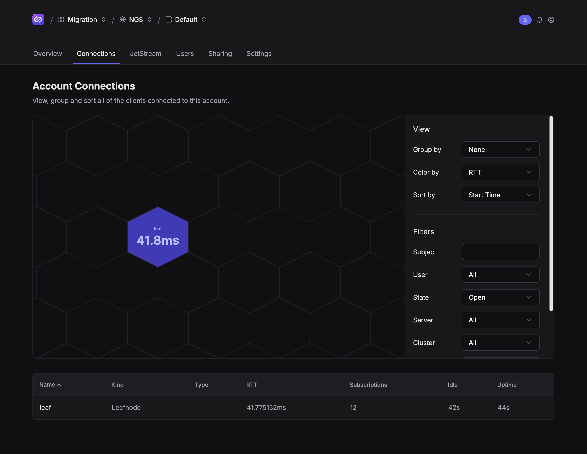

## Steps

### Initialize operator, account, and users with `nsc`

```shell
❯ make init-nsc
❯ tree -L2 .nsc 
.nsc
├── creds
│   └── memory
├── keys
│   ├── A
│   ├── O
│   └── U
├── memory
│   ├── accounts
│   └── memory.jwt
├── nsc.conf
└── nsc.json
```

### Start local NATS server

```shell
❯ make
nats-server -c nats.conf
[18828] 2025/08/14 10:53:52.434907 [INF] Starting nats-server
[18828] 2025/08/14 10:53:52.434991 [INF]   Version:  2.11.7
[18828] 2025/08/14 10:53:52.434993 [INF]   Git:      [df44964]
[18828] 2025/08/14 10:53:52.435006 [INF]   Cluster:  leaf
[18828] 2025/08/14 10:53:52.435007 [INF]   Name:     leaf
[18828] 2025/08/14 10:53:52.435008 [INF]   Node:     ZLMV550B
[18828] 2025/08/14 10:53:52.435009 [INF]   ID:       NDCVTRDUCIKXHIDXV5E2B2BTSZ5L7WOZFKSH35UMX5DSUF57RNUPYHDL
[18828] 2025/08/14 10:53:52.435026 [INF] Trusted Operators
[18828] 2025/08/14 10:53:52.435028 [INF]   System  : ""
[18828] 2025/08/14 10:53:52.435029 [INF]   Operator: "memory"
[18828] 2025/08/14 10:53:52.435031 [INF]   Issued  : 2025-08-14 10:51:51 -0600 MDT
[18828] 2025/08/14 10:53:52.435038 [INF]   Expires : Never
[18828] 2025/08/14 10:53:52.436161 [INF] Starting JetStream
[18828] 2025/08/14 10:53:52.436167 [WRN] Temporary storage directory used, data could be lost on system reboot
[18828] 2025/08/14 10:53:52.436715 [INF]     _ ___ _____ ___ _____ ___ ___   _   __  __
[18828] 2025/08/14 10:53:52.436717 [INF]  _ | | __|_   _/ __|_   _| _ \ __| /_\ |  \/  |
[18828] 2025/08/14 10:53:52.436718 [INF] | || | _|  | | \__ \ | | |   / _| / _ \| |\/| |
[18828] 2025/08/14 10:53:52.436719 [INF]  \__/|___| |_| |___/ |_| |_|_\___/_/ \_\_|  |_|
[18828] 2025/08/14 10:53:52.436720 [INF]
[18828] 2025/08/14 10:53:52.436721 [INF]          https://docs.nats.io/jetstream
[18828] 2025/08/14 10:53:52.436722 [INF]
[18828] 2025/08/14 10:53:52.436723 [INF] ---------------- JETSTREAM ----------------
[18828] 2025/08/14 10:53:52.436758 [INF]   Max Memory:      1.00 GB
[18828] 2025/08/14 10:53:52.436760 [INF]   Max Storage:     1.00 GB
[18828] 2025/08/14 10:53:52.436761 [INF]   Store Directory: "/var/folders/q3/sxmzn9xs6r90xcfzr3g5ch2m0000gn/T/jetstream"
[18828] 2025/08/14 10:53:52.436762 [INF]   API Level:       1
[18828] 2025/08/14 10:53:52.436764 [INF] -------------------------------------------
[18828] 2025/08/14 10:53:52.437383 [INF] Listening for client connections on 0.0.0.0:4222
[18828] 2025/08/14 10:53:52.437509 [INF] Server is ready
```

### Create local stream and consumers using Terraform.
```shell
❯ cd ./tf/local
❯ terraform apply -auto-approve  # or `terraform plan -out plan.out` and `terraform apply plan.out`
Terraform used the selected providers to generate the following execution plan. Resource actions are indicated with the following symbols:
  + create

Terraform will perform the following actions:

  # jetstream_consumer.ORDERS will be created
  + resource "jetstream_consumer" "ORDERS" {
      + ...
    }

  # jetstream_consumer.SHIPMENTS will be created
  + resource "jetstream_consumer" "SHIPMENTS" {
      + ...
    }

  # jetstream_stream.QUEUE will be created
  + resource "jetstream_stream" "QUEUE" {
      + ...
    }

Plan: 3 to add, 0 to change, 0 to destroy.
jetstream_stream.QUEUE: Creating...
jetstream_stream.QUEUE: Creation complete after 1s [id=JETSTREAM_STREAM_QUEUE]
jetstream_consumer.SHIPMENTS: Creating...
jetstream_consumer.ORDERS: Creating...
jetstream_consumer.ORDERS: Creation complete after 0s [id=JETSTREAM_STREAM_QUEUE_CONSUMER_ORDERS]
jetstream_consumer.SHIPMENTS: Creation complete after 0s [id=JETSTREAM_STREAM_QUEUE_CONSUMER_SHIPMENTS]

Apply complete! Resources: 3 added, 0 changed, 0 destroyed.
```

View the created stream and consumer.
```shell
❯ nats --creds ../../.nsc/creds/memory/A/admin.creds stream report
Obtaining Stream stats

╭─────────────────────────────────────────────────────────────────────────────────────────╮
│                                      Stream Report                                      │
├────────┬─────────┬───────────┬───────────┬──────────┬───────┬──────┬─────────┬──────────┤
│ Stream │ Storage │ Placement │ Consumers │ Messages │ Bytes │ Lost │ Deleted │ Replicas │
├────────┼─────────┼───────────┼───────────┼──────────┼───────┼──────┼─────────┼──────────┤
│ QUEUE  │ File    │           │ 2         │ 0        │ 0 B   │ 0    │ 0       │          │
╰────────┴─────────┴───────────┴───────────┴──────────┴───────┴──────┴─────────┴──────────╯

❯ nats --creds ../../.nsc/creds/memory/A/admin.creds consumer report QUEUE
╭──────────────────────────────────────────────────────────────────────────────────────────────────────────╮
│                                Consumer report for QUEUE with 2 consumers                                │
├───────────┬──────┬────────────┬──────────┬─────────────┬─────────────┬─────────────┬───────────┬─────────┤
│ Consumer  │ Mode │ Ack Policy │ Ack Wait │ Ack Pending │ Redelivered │ Unprocessed │ Ack Floor │ Cluster │
├───────────┼──────┼────────────┼──────────┼─────────────┼─────────────┼─────────────┼───────────┼─────────┤
│ ORDERS    │ Pull │ Explicit   │ 30.00s   │ 0           │ 0           │ 0           │ 0         │         │
│ SHIPMENTS │ Pull │ Explicit   │ 30.00s   │ 0           │ 0           │ 0           │ 0         │         │
╰───────────┴──────┴────────────┴──────────┴─────────────┴─────────────┴─────────────┴───────────┴─────────╯
```

### Start publisher

Begin publishing test data to the local stream. Install [Go](https://go.dev/) if it is not installed.

```shell
❯ cd demo
❯ make publisher
Publishing on nats://localhost:4222
Publishing order 1
```

In another tab, verify the stream has messages and the `ORDERS` consumer has unprocessed messages.
```shell
# from the root of the repo
❯ nats --creds .nsc/creds/memory/A/admin.creds stream report
Obtaining Stream stats

╭─────────────────────────────────────────────────────────────────────────────────────────╮
│                                      Stream Report                                      │
├────────┬─────────┬───────────┬───────────┬──────────┬───────┬──────┬─────────┬──────────┤
│ Stream │ Storage │ Placement │ Consumers │ Messages │ Bytes │ Lost │ Deleted │ Replicas │
├────────┼─────────┼───────────┼───────────┼──────────┼───────┼──────┼─────────┼──────────┤
│ QUEUE  │ File    │           │ 2         │ 3        │ 132 B │ 0    │ 0       │          │
╰────────┴─────────┴───────────┴───────────┴──────────┴───────┴──────┴─────────┴──────────╯

❯ nats --creds .nsc/creds/memory/A/admin.creds consumer report QUEUE
╭────────────────────────────────────────────────────────────────────────────────────────────────────────╮
│                               Consumer report for QUEUE with 2 consumers                               │
├───────────┬──────┬────────────┬──────────┬─────────────┬─────────────┬─────────────┬───────────┬───────┤
│ Consumer  │ Mode │ Ack Policy │ Ack Wait │ Ack Pending │ Redelivered │ Unprocessed │ Ack Floor │ Clust │
├───────────┼──────┼────────────┼──────────┼─────────────┼─────────────┼─────────────┼───────────┼───────┤
│ ORDERS    │ Pull │ Explicit   │ 30.00s   │ 0           │ 0           │ 3 / 100%    │ 0         │       │
│ SHIPMENTS │ Pull │ Explicit   │ 30.00s   │ 0           │ 0           │ 0           │ 0         │       │
╰───────────┴──────┴────────────┴──────────┴─────────────┴─────────────┴─────────────┴───────────┴───────╯
```

### Start services

Start the `orders` and `shipments` services, which will consume messages from their respective consumers.
```shell
❯ cd demo
❯ make orders
Consuming orders on nats://localhost:4222
Received order: 1
Received order: 2

# in another tab
❯ cd demo
❯ make shipments
Consuming shipments on nats://localhost:4222
Received shipment: 1
Received shipment: 2
```

Confirm that messages in the consumers are being processed.
```shell
❯ nats --creds .nsc/creds/memory/A/admin.creds consumer report QUEUE
╭──────────────────────────────────────────────────────────────────────────────────────────────────────────╮
│                                Consumer report for QUEUE with 2 consumers                                │
├───────────┬──────┬────────────┬──────────┬─────────────┬─────────────┬─────────────┬───────────┬─────────┤
│ Consumer  │ Mode │ Ack Policy │ Ack Wait │ Ack Pending │ Redelivered │ Unprocessed │ Ack Floor │ Cluster │
├───────────┼──────┼────────────┼──────────┼─────────────┼─────────────┼─────────────┼───────────┼─────────┤
│ ORDERS    │ Pull │ Explicit   │ 30.00s   │ 95          │ 0           │ 26 / 18%    │ 35        │         │
│ SHIPMENTS │ Pull │ Explicit   │ 30.00s   │ 10          │ 0           │ 12 / 8%     │ 147       │         │
╰───────────┴──────┴────────────┴──────────┴─────────────┴─────────────┴─────────────┴───────────┴─────────╯
```

### Download credentials for a NATS user from Synadia Cloud

Navigate to the `Team > System > Account > NATS User` you want to use to connect the local system to Synadia Cloud. Click `Get Connected` and download the credentials file. Save it to `./tf/cloud/cloud.creds`.

### Create Synadia Cloud stream and consumers using Terraform.

```shell
❯ cd ./tf/cloud
❯ terraform apply -auto-approve  # or `terraform plan -out plan.out` and `terraform apply plan.out`

Terraform used the selected providers to generate the following execution plan. Resource actions are indicated with the following symbols:
  + create

Terraform will perform the following actions:

  # jetstream_consumer.ORDERS_cloud will be created
  + resource "jetstream_consumer" "ORDERS_cloud" {
      + ...
    }

  # jetstream_consumer.SHIPMENTS_cloud will be created
  + resource "jetstream_consumer" "SHIPMENTS_cloud" {
      + ...
    }

  # jetstream_stream.QUEUE_source will be created
  + resource "jetstream_stream" "QUEUE_source" {
      + ...
    }

Plan: 3 to add, 0 to change, 0 to destroy.
jetstream_stream.QUEUE_source: Creating...
jetstream_stream.QUEUE_source: Creation complete after 1s [id=JETSTREAM_STREAM_QUEUE_source]
jetstream_consumer.ORDERS_cloud: Creating...
jetstream_consumer.SHIPMENTS_cloud: Creating...
jetstream_consumer.ORDERS_cloud: Creation complete after 1s [id=JETSTREAM_STREAM_QUEUE_source_CONSUMER_ORDERS]
jetstream_consumer.SHIPMENTS_cloud: Creation complete after 1s [id=JETSTREAM_STREAM_QUEUE_source_CONSUMER_SHIPMENTS]

Apply complete! Resources: 3 added, 0 changed, 0 destroyed.
```

View the created stream and consumer.
```shell
❯ nats --server tls://connect.ngs.global --creds tf/cloud/cloud.creds stream report
╭─────────────────────────────────────────────────────────────────────────────────────────────────────────────╮
│                                                Stream Report                                                │
├──────────────┬─────────┬───────────┬───────────┬──────────┬───────┬──────┬─────────┬────────────────────────┤
│ Stream       │ Storage │ Placement │ Consumers │ Messages │ Bytes │ Lost │ Deleted │ Replicas               │
├──────────────┼─────────┼───────────┼───────────┼──────────┼───────┼──────┼─────────┼────────────────────────┤
│ QUEUE_source │ File    │           │ 2         │ 0        │ 0 B   │ 0    │ 0       │ aws-uswest2-natscj1-1* │
╰──────────────┴─────────┴───────────┴───────────┴──────────┴───────┴──────┴─────────┴────────────────────────╯

╭────────────────────────────────────────────────────────────────────────────────────────────────────╮
│                                         Replication Report                                         │
├──────────────┬────────┬────────────┬───────────────┬────────────────────────┬────────┬─────┬───────┤
│ Stream       │ Kind   │ API Prefix │ Source Stream │ Filters and Transforms │ Active │ Lag │ Error │
├──────────────┼────────┼────────────┼───────────────┼────────────────────────┼────────┼─────┼───────┤
│ QUEUE_source │ Source │            │ QUEUE         │                        │ 0s     │ 0   │       │
╰──────────────┴────────┴────────────┴───────────────┴────────────────────────┴────────┴─────┴───────╯

❯ nats --server tls://connect.ngs.global --creds tf/cloud/cloud.creds consumer report QUEUE_source
╭─────────────────────────────────────────────────────────────────────────────────────────────────────────────────────────╮
│                                    Consumer report for QUEUE_source with 2 consumers                                    │
├───────────┬──────┬────────────┬──────────┬─────────────┬─────────────┬─────────────┬───────────┬────────────────────────┤
│ Consumer  │ Mode │ Ack Policy │ Ack Wait │ Ack Pending │ Redelivered │ Unprocessed │ Ack Floor │ Cluster                │
├───────────┼──────┼────────────┼──────────┼─────────────┼─────────────┼─────────────┼───────────┼────────────────────────┤
│ ORDERS    │ Pull │ Explicit   │ 30.00s   │ 0           │ 0           │ 0           │ 0         │ aws-uswest2-natscj1-1* │
│ SHIPMENTS │ Pull │ Explicit   │ 30.00s   │ 0           │ 0           │ 0           │ 0         │ aws-uswest2-natscj1-1* │
╰───────────┴──────┴────────────┴──────────┴─────────────┴─────────────┴─────────────┴───────────┴────────────────────────╯
```

### Connect local NATS server as leaf node

Get the public nkey of the local account `A`.
```shell
❯ grep -A1 '// Account "A"' .nsc/nsc.conf | grep -v '//' | cut -d':' -f1
A...  # 56 chars
```

Open `nats.conf` in a text editor and update the `account` value in the `leafnodes.remotes` block.
```shell
leafnodes {
  remotes = [
    {
      url: "tls://connect.ngs.global"
      credentials: "./tf/cloud/cloud.creds"
      account: "A..."
    }
  ]
}
```

Restart the NATS server (the `reload` signal is not supported when editing `leafnodes.remotes`, e.g. `nats-server –signal reload`).

Verify the leaf node shows up in the Synadia Cloud connections graph, under `Team > System > Account > Connections`.


